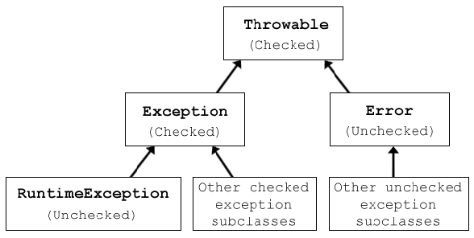
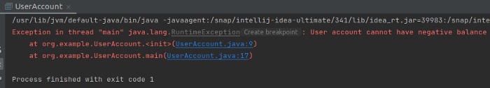
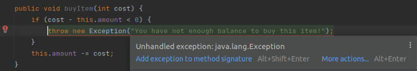
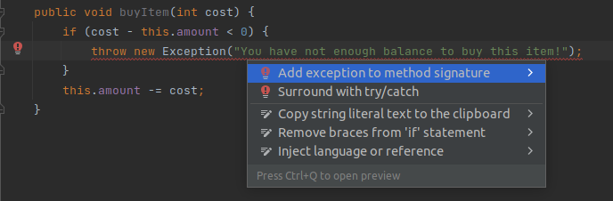
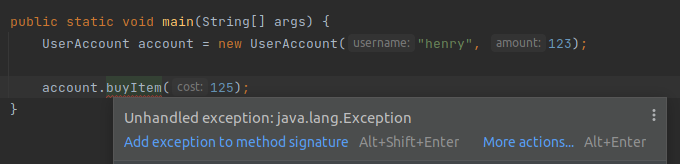
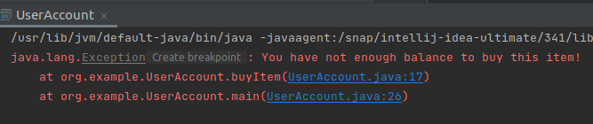

https://medium.com/@bsr.ercelik/exceptions-in-java-b7efa1fc2500

# Exceptions in Java
An exception is an event that distrusts the normal flow of your application. Most programming languages have a mechanism to deal with this sort of situations. In Java, there is Exception object which contains information about the error.



There is a hierarchy for Exceptions in Java. Throwable class is the parent of every error and exception. Exception class is for checked exceptions and Runtime Exception class is parent for all unchecked exceptions.
## Unchecked Exceptions
These are called runtime exceptions, it’s not checked in compile time.
Common unchecked exceptions are:
- NullPointerException
- ArithmeticException
- IllegalArgumentException
Let’s write a UserAccount class and we check if the account is less than zero in the constructor. If the account has negative value we throw an runtime exception.

```java
package org.example;
public class UserAccount {
 private String username;
 private int amount;
public UserAccount(String username, int amount) {
 if (amount < 0) {
 throw new RuntimeException(“User account cannot have negative balance”);
 }
 this.username = username;
 this.amount = amount;
 }
}
```
Now I can create user account without need of handling exception. Notice that there is no compiler warning. At compile time there is no warning that shows me possible errors that may occur.
```java
public static void main(String[] args) {
 UserAccount account1 = new UserAccount(“henry”, 123);
 UserAccount account2 = new UserAccount(“jack”, -5);
 }
```
But if i run this application the exception will be thrown as seen in the image.


## Checked Exceptions
A method must be handled in its body or throw to the caller method. Checked exceptions force the user to handle that exception at compile time. Common checked exceptions are:
- IOExceptions
- InterruptedException
- FileNotFoundException
I have added one method for buying new item. If user doesn’t have enough money to buy an item we throw an checked exception. As soon as i wrote this code compiler warns me to handle the exception.
```java
public void buyItem(int cost) {
    if (cost - this.amount < 0) {
        throw new Exception("You have not enough balance to buy this item!");
    }
    this.amount -= cost;
}
```

We can handle this exception either by adding exception method signature or surround with try/catch.

I will go ahead with adding exception method signature. That means this method may throw an exception and I’m supposed to handle exception wherever I call this method.
```java
public void buyItem(int cost) throws Exception {
    if (this.amount - cost < 0) {
        throw new Exception("You have not enough balance to buy this item!");
    }
    this.amount -= cost;
}
```
As I mentioned above, once I called buyItem() method compiler forced me to handle exception again. Because I preferred to throw exception in method signutare.

Run the application:
```java
public static void main(String[] args) {
    UserAccount account = new UserAccount("henry", 123);

    try {
        account.buyItem(125);
    } catch (Exception e) {
        e.printStackTrace();
    }
}
```

References:
https://stackoverflow.com/questions/37170572/why-do-you-need-to-catch-exception-but-not-the-subclass-runtimeexception