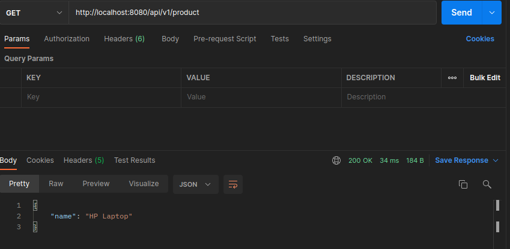
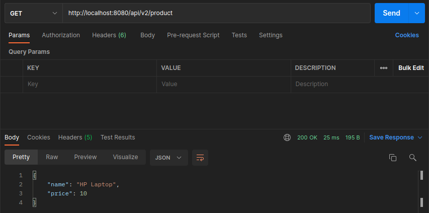
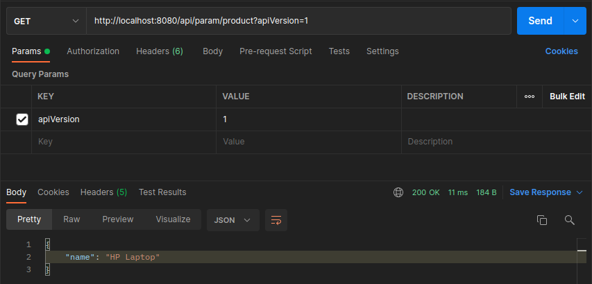
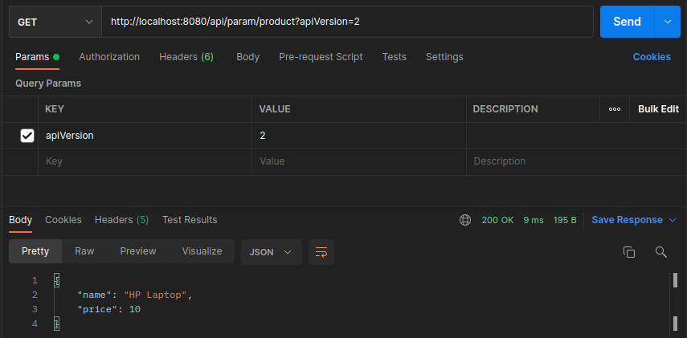
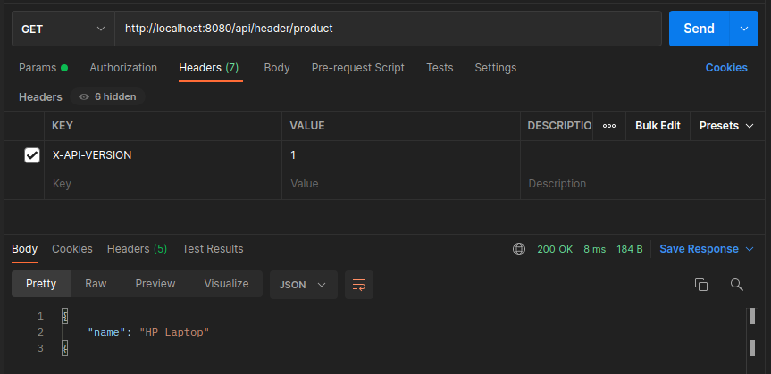
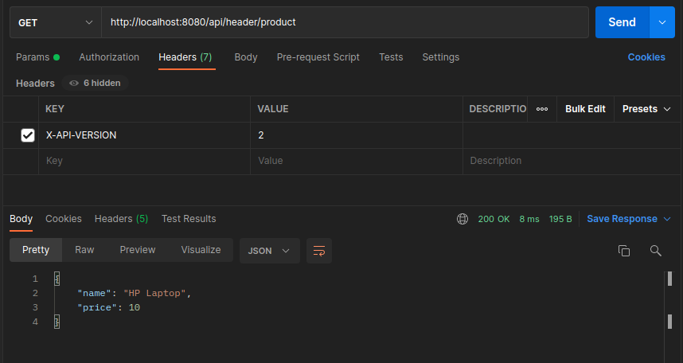

# API URI Versiyonlama
Çok fazla müşteriniz olduğunu ve bunların sizin API'larınız üzerinde sürekli geliştirme yaptığını düşünelim. Bu durumda versiyonlama
yapmaya ihtiyaç duymaya başlarsınız. Ya da hem desktop hem de mobil uygulamanız var ve bu ikisi arasında versiyon farkı varsa 
gene API versiyonlamadan yaralanırız.

Uri versioning genelde farklı 3 yöntem kullanılır. Bunlardan ilki direk uri üzerinde v1 veya v2 şeklinde path ile yapılır.
Aşağıda postman üzerinden atılan get isteklerinin ekran görüntülerinden de url'i görebilirsiniz.
İkinci yöntem parametrede yapılan değişikliktir. Buradaki fark parametrede ek olarak ?apiVersion=1 alanının eklenmesidir.
GetMapping kullanırken params değerine atarız. Üçüncü yöntem ise parametre versiyonlamaya benziyor ancak buradaki fark
versiyonu parametrede değil header'da gönderiyoruz. GetMapping kullanırken headers alanına değerimizi atarız. Burada verilen değerin best practice
olarak X-API-VERSION=2 gibi  X ile başlaması uygundur.  

Bu versiyonlama işlemlerimizi orta katmanda API'mızda hiçbir değişiklik yapmadan APIGateway dediğimiz ürünlerle yönetebiliriz.
Open source ve ücretli APIGateway ürünleri mevcuttur. Küçük veya orta ölçekli projelerde projeden daha çok kaynak tüketecek bir
APIGateway konumlandırmak çok doğru olmayabilir. Kod üzerinde uri versiyonlama yapmak daha uygun olabilir.
~~~java
package com.versioning.api;

import com.versioning.dto.ProductV1;
import com.versioning.dto.ProductV2;
import org.springframework.http.ResponseEntity;
import org.springframework.web.bind.annotation.GetMapping;
import org.springframework.web.bind.annotation.RequestMapping;
import org.springframework.web.bind.annotation.RestController;

import java.math.BigDecimal;
import java.util.Optional;

@RestController
@RequestMapping(value = "/api")
public class ProductController {
    // URI Versioning
    // http://localhost:8080/api/v1/product
    @GetMapping(value = "/v1/product")
    public ResponseEntity<ProductV1> pathVersioningProductV1() {
        return ResponseEntity.of(Optional.of(new ProductV1("HP Laptop")));
    }

    // http://localhost:8080/api/v2/product
    @GetMapping(value = "/v2/product")
    public ResponseEntity<ProductV2> pathVersioningProductV2() {
        return ResponseEntity.of(Optional.of(new ProductV2("HP Laptop", BigDecimal.TEN)));
    }

    // Param Versioning
    // http://localhost:8080/api/param/product?apiVersion=1
    @GetMapping(value = "/param/product", params = "apiVersion=1")
    public ResponseEntity<ProductV1> paramVersioningProductV1() {
        return ResponseEntity.of(Optional.of(new ProductV1("HP Laptop")));
    }

    // http://localhost:8080/api/param/product?apiVersion=2
    @GetMapping(value = "/param/product",  params = "apiVersion=2")
    public ResponseEntity<ProductV2> paramVersioningProductV2() {
        return ResponseEntity.of(Optional.of(new ProductV2("HP Laptop", BigDecimal.TEN)));
    }

    // Header Versioning
    // http://localhost:8080/api/header/product
    @GetMapping(value = "/header/product", headers = "X-API-VERSION=1")
    public ResponseEntity<ProductV1> headerVersioningProductV1() {
        return ResponseEntity.of(Optional.of(new ProductV1("HP Laptop")));
    }

    // http://localhost:8080/api/header/product
    @GetMapping(value = "/header/product",  headers = "X-API-VERSION=2")
    public ResponseEntity<ProductV2> headerVersioningProductV2() {
        return ResponseEntity.of(Optional.of(new ProductV2("HP Laptop", BigDecimal.TEN)));
    }
}

~~~
## URI Versioning
    http://localhost:8080/api/v1/product

    http://localhost:8080/api/v2/product

## Param Versioning
    http://localhost:8080/api/param/product?apiVersion=1

    http://localhost:8080/api/param/product?apiVersion=2

## Header Versioning
    http://localhost:8080/api/header/product

    
    http://localhost:8080/api/header/product

Referans: https://www.youtube.com/watch?v=Cn7_8D51tsQ&list=PLd0jsEi3hUAfg1-tqxFvDA9q-kpZ4q4uE&index=23