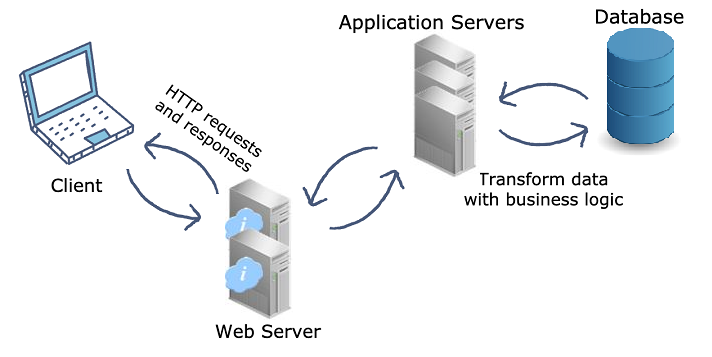

# Devops
DevOps is how engineering organizations collaborate using cross-functional teams. Devops coming from the two words the development and the operations.we need to understand what Devops is not. DevOps is not a tool, it is not a software, it is not at all a programming language that you can learn and call yourself as a DevOps engineer. DevOps is one of that mindset and one of the working ways to produce things from here the development side into the production stage. DevOps is a concept that is used in the application lifecycle management. Whenever application is being developed there are variety of phases of its development.
DevOps increases an organization's ability to deploy applications and services faster and provides many advantages for any company that wants to stay competitive in today’s fast-paced world.
# DevSecOps
DevSecOps extends the DevOps mindset, a philosophy that integrates security practices into every phase of DevOps. The DevSecOps methodology creates a ‘Security as Code’ culture.
First, the DevOps team develops and deploys the app; then information security fills in any gaps in security.
# Dockerfile
A Docker Image is a read-only file with a bunch of instructions. When these instructions are executed, it creates a Docker container.
Dockerfile is a simple text file that consists of instructions to build Docker images.
Dockerfile consists of specific commands to build a specific Docker image.The specific commands you can use in a dockerfile are:

    FROM, PULL, RUN, and CMD

FROM - Creates a layer from the ubuntu:18.04
PULL - Adds files from your Docker repository
RUN - Builds your container
CMD - Specifies what command to run within the container
Mentioned below is an example of the dockerfile with the important commands

```Dockerfile
FROM ubuntu:18.04

PULL. /file

RUN make /file

CMD python /file/file.py
```
Let’s first declare the path where we will be storing the dockerfile simplidocker

    docker build [OPTIONS] PATH | URL | -

# Jenkins
In the past developers had to wait till the entire software code was built and tested to check for errors.
Developers had to check the entire source code to find the errors. In such case,
fixing bugs was very difficult. There was no iterative improvement of code and software delivery process was slow. 

Jenkins is continuous integration tool that allows continuous development, test and deployment of newly created codes.
So you are able to submit your codes consistently into a source code environment. Jenkins provides continuous integration. 
For example you commit changes to the source code and code is pulled whenever there is a commit made to the source code.
All the changes made to the source code is build continuously. This is the power of Jenkins. 

# Web server
In simple terms, a web server is a computer that stores, processes, and delivers website files to web browsers.

Web servers consist of hardware and software that use Hypertext Transfer Protocol (HTTP) to respond to web users’ requests made via the WWW.

Through this process, web servers load and deliver the requested page to the user’s browser – Google Chrome, for example.

# Application server
Application server specifically designed to run applications. 
Application server is software that is placed on server side, and this software helps to deliver business logic back end of any application.
Provides processing power and memory to run demanding applications. Also provides the environment to run specific applications.
There are different types of application servers, like as:

- JBoss
- Weblogic
- Websphere Application Server and Community Edition
- WebObjects
- Glassfish
- Tomcat

# Tomcat
Tomcat is a Java Servlet container and web server. It can be used as standalone, or it can be used behind traditional web servers.
A web server uses the request/response message exchange pattern to serve web pages. 

# Netty
Netty is a high performance IO toolkit for Java. Netty is open source.In general, Netty makes it a lot easier to build scalable, robust networked applications compared to implemeting the same using standard Java.
Using Netty's IO tools it is easy to start an HTTP server, WebSocket server etc. It takes just a few lines of code.

References:
https://www.serverwatch.com/guides/application-server/
https://www.youtube.com/watch?v=LFDrDnKPOTg
https://www.youtube.com/watch?v=RSFfO8g6r90